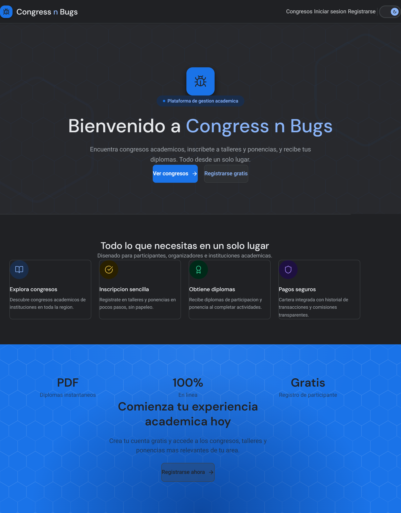

# Congress n Bugs

<p align="center">
  
</p>

<p align="center">
  Academic congress management platform built with a modern frontend and a microservices-based backend.
</p>

<p align="center">
  <a href="https://frontend-spa-rho.vercel.app/">Live Frontend</a>
  ·
  <a href="./docs/Proyecto-2_B.pdf">Project Brief</a>
</p>

---

## Overview

Congress n Bugs is a web platform created to manage academic congresses, participants, activities, registrations, certificates, and payment flows within a single system.

The project was developed collaboratively using a distributed architecture, separating frontend, infrastructure, and backend services into independent repositories.

The frontend remains publicly accessible, while the backend services and infrastructure were previously deployed on DigitalOcean and are ready to be reactivated.

---

## Scope

The platform supports flows such as:

* congress and institution management
* participant registration and authentication
* workshop and paper registration
* attendance tracking
* certificate generation
* wallet-based payments and transaction history

---

## Architecture

```text
Frontend → API Gateway → Eureka Discovery → Microservices
```

The system is organized as a multi-repository project with clearly separated responsibilities across application, infrastructure, and service layers.

---

## Repositories

| Component               | Repository                                                                                        | Purpose                                                       |
| ----------------------- | ------------------------------------------------------------------------------------------------- | ------------------------------------------------------------- |
| Frontend App            | [JeffMenca/frontend-spa](https://github.com/JeffMenca/frontend-spa)                               | Web application                                               |
| Platform Infrastructure | [MenWic/AyD2.p2.platform_infra](https://github.com/MenWic/AyD2.p2.platform_infra)                 | Eureka Server and API Gateway                                 |
| IAM Service API         | [MenWic/AyD2.p2.iam_service_api](https://github.com/MenWic/AyD2.p2.iam_service_api)               | Authentication, users, roles, access flows                    |
| Conference Service API  | [MenWic/AyD2.p2.conference_service_api](https://github.com/MenWic/AyD2.p2.conference_service_api) | Congress domain logic, institutions, activities, certificates |
| Wallet Service API      | [MenWic/AyD2.p2.wallet_service_api](https://github.com/MenWic/AyD2.p2.wallet_service_api)         | Wallet, payments, top-ups, transactions                       |

---

## Stack

### Frontend

* Next.js
* Tailwind CSS
* shadcn/ui
* React Hook Form
* Zod
* Vitest
* Playwright

### Backend

* Java 21
* Spring Boot
* PostgreSQL
* Flyway
* OpenAPI / Swagger
* JWT
* JaCoCo
* Docker / Testcontainers

### Infrastructure

* Eureka Server
* API Gateway
* GitHub Actions
* Vercel
* DigitalOcean

---

## Backend Services

### IAM Service

Handles authentication, user registration, roles, and access-related flows.

### Conference Service

Handles congresses, institutions, activities, participants, attendance, and certificates.

### Wallet Service

Handles wallet operations, payments, top-ups, and transaction records.

### Platform Infra

Handles service discovery and gateway routing for the platform.

---

## Deployment

### Frontend

The frontend is deployed on Vercel:

**https://frontend-spa-rho.vercel.app/**

### Backend and infrastructure

The backend services and infrastructure were deployed on DigitalOcean during development. They are currently offline, but the environment is prepared for reactivation.

> The frontend can still be reviewed visually. Full platform execution depends on bringing the backend services back online.

---

## Project Assets

* Application screenshot: `./img/frontend-spa.png`
* Project brief: `./docs/Proyecto-2_B.pdf`

---

## Contributors

* [Luis Alejandro Méndez Rivera](https://github.com/MenWic)
* [Jeff Menca](https://github.com/JeffMenca)
* [Roberto Tobar](https://github.com/rrobertobt)

---

## Notes

This repository serves as the main entry point for the project and centralizes the references to the repositories that make up the full solution.
